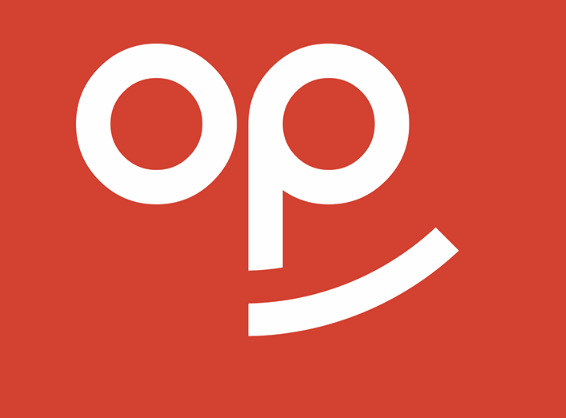

<div align="center">



# OpenPrompter

**Teleprompter gratuit, open-source et discret pour macBook.**  
Défile ton script dans la encoche, dans une fenêtre flottante, ou les deux.

[](https://apple.com/macos)
[](https://developer.apple.com/swift/)
[](#)
[](#licence)
[](#)

---

> **OpenPrompter est 100% gratuit, open-source, et le restera toujours.**  
> Pas d'abonnement. Pas de pub. Pas de tracking.

---

<!-- SCREENSHOT PRINCIPALE ICI -->
<!--  -->

</div>

---

## ✨ Fonctionnalités

| Fonctionnalité | Détail |
|---|---|
| 🔲 **Prompteur dans la encoche** | Affiche ton script directement dans la Dynamic Island / encoche du MacBook |
| 🪟 **Fenêtre flottante** | Fenêtre toujours visible en overlay, défilement horizontal ou vertical |
| 🎤 **Détection vocale automatique** | Le défilement s'adapte à ta voix en temps réel via le micro |
| 🙈 **Invisible en screen share** | La fenêtre disparaît automatiquement lors du partage d'écran |
| 🔤 **Personnalisation complète** | Choix de la police, de la taille et de la couleur du texte |
| 🎯 **Calibration de la encoche** | Positionnement précis du prompteur dans la encoche |

---


## 🚀 Installation

### Téléchargement direct

1. Télécharge la dernière version sur la page [**Releases**](../../releases)
2. Ouvre le fichier `.dmg` ou décompresse le `.zip`
3. Glisse `OpenPrompter.app` dans ton dossier **Applications**
4. Lance l'app — accepte la demande d'accès au microphone si tu veux la détection vocale

> **⚠️ Première ouverture :** macOS peut afficher un avertissement de sécurité car l'app n'est pas signée via l'App Store.  
> Va dans **Réglages système → Confidentialité et sécurité** et clique sur **"Ouvrir quand même"**.

### Compilation depuis les sources

```bash
git clone https://github.com/TON_USERNAME/OpenPrompter.git
cd OpenPrompter
open OpenPrompter.xcodeproj
```

Puis compile et lance depuis Xcode (`⌘R`).

**Prérequis :**
- macOS 14.0 (Sonoma) ou supérieur
- Xcode 16+

---

## 🎬 Utilisation

### 1. Écrire ton script

Lance OpenPrompter. L'éditeur principal s'ouvre — écris ou colle ton script directement.

### 2. Lancer le prompteur

Depuis la barre de menu ou l'interface :

- **Prompteur Notch** → affiche le texte dans la encoche du MacBook
- **Fenêtre flottante** → ouvre une fenêtre overlay déplaçable et redimensionnable

### 3. Contrôle du défilement

- Ajuste la **vitesse de défilement** dans les réglages
- Active la **détection vocale** pour que le scroll s'adapte automatiquement à ton rythme de parole
- Navigue avec les boutons de contrôle (retour au début, pause, reprise)

### 4. Calibrer la encoche

Si le prompteur est mal positionné dans la encoche :

1. Va dans **Calibrer la encoche**
2. Clique sur le **coin gauche** de la encoche quand demandé
3. Clique sur le **coin droit** de la encoche quand demandé
4. La calibration est sauvegardée automatiquement

---

## ⚙️ Paramètres disponibles

| Paramètre | Options |
|---|---|
| **Police** | Système, Serif, Monospace, Arrondi, Georgia… |
| **Taille du texte** | Ajustable via curseur |
| **Couleur du texte** | Personnalisable |
| **Direction de défilement** | Horizontal / Vertical |
| **Vitesse de défilement** | Ajustable |
| **Seuil de détection vocale** | Seuil de démarrage et d'arrêt configurables |
| **Taille de la encoche** | Agrandit la fenêtre vers le bas |

---

## 🏗️ Stack technique

- **Langage :** Swift
- **Framework UI :** SwiftUI
- **Audio :** AVFoundation (AVAudioEngine, AVAudioPCMBuffer)
- **Fenêtres spéciales :** AppKit (NSWindow pour Notch & Floating)
- **Réactivité :** Combine (ObservableObject)
- **Cible :** macOS 14+

---

## 🙏 Pourquoi OpenPrompter ?

Ce projet est né parce que les apps de teleprompter existantes coûtent cher — et ça ne devrait pas être le cas.

> *« Parce que Moody coûte cher et que ça devrait être gratuit pour tout le monde. »*

OpenPrompter est fait **pour la communauté, par la communauté.** Si tu veux contribuer, les PRs sont les bienvenues !

---

## 🤝 Contribuer

1. Fork le repo
2. Crée ta branche (`git checkout -b feature/ma-fonctionnalite`)
3. Commit tes changements (`git commit -m 'feat: ajoute ma fonctionnalité'`)
4. Push sur ta branche (`git push origin feature/ma-fonctionnalite`)
5. Ouvre une Pull Request

Toutes les contributions sont les bienvenues : nouvelles fonctionnalités, corrections de bugs, améliorations de la doc ou traductions.

---

## 📄 Licence

Distribué sous licence **MIT**. Voir [`LICENSE`](LICENSE) pour plus d'informations.

---

<div align="center">

Fait avec ❤️ pour macOS 14+  
**Gratuit. Open-source. Pour toujours.**

</div>
